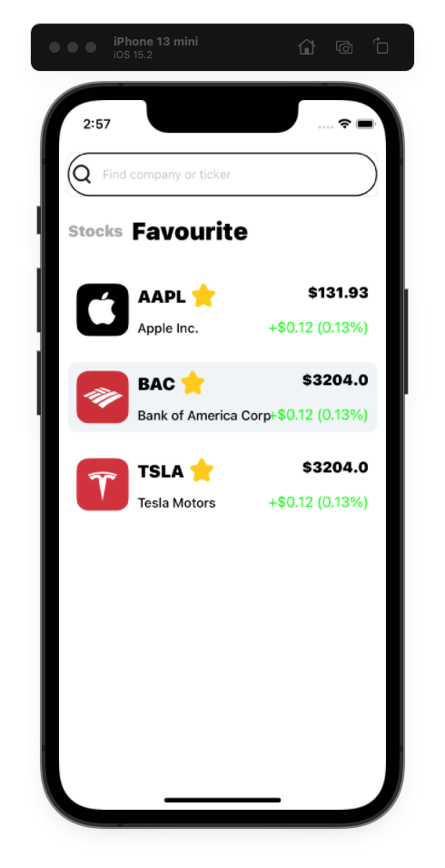

# LuxuryStocks
Тестовое задание для iOS

LuxuryStocks - простое iOS-приложение для просмотра акций с возможностью работы полностью в режиме Offline

# Архитектура проекта
1. UI - в проекте используется Storyboards, XIBs и SnapKit для Autolayout
2. Приложение полностью работоспособно в режиме Offline без доступа к интернету. При попытке загрузить список акций без интернета будет автоматически произведена загрузка списка из кэша и пользователю при этом высветится сообщение о проблеме доступа к сети
3. Все логотипы акций также кэшируются в Documents directory и также точно восстанавливаются из кэша при загрузке без интернета
4. Для хранения данных кэша используется бд Realm
5. Для десериализации entities акций из JSON используется протокол Decodable
6. В проекте используются кастомные UI-компоненты для строки поиска, верхнего таббара и области с облачками подсказок для поиска
7. Для View с поисковыми подсказками используется автоматический подсчет ширины строки для автоматического расширения по вертикали области подсказок
8. Используется фреймворк Combine для реактивного запроса данных от API и от БД в проекте

#### Скриншоты

